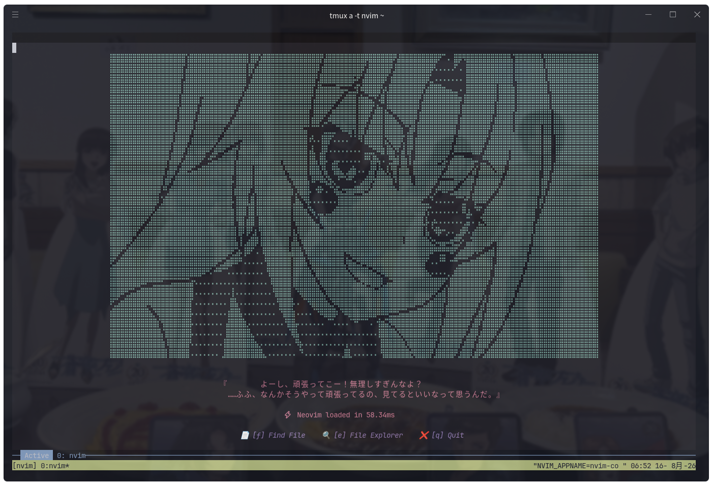
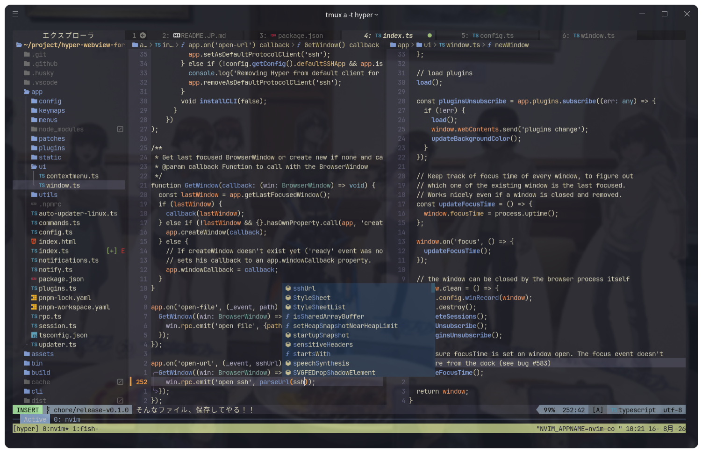
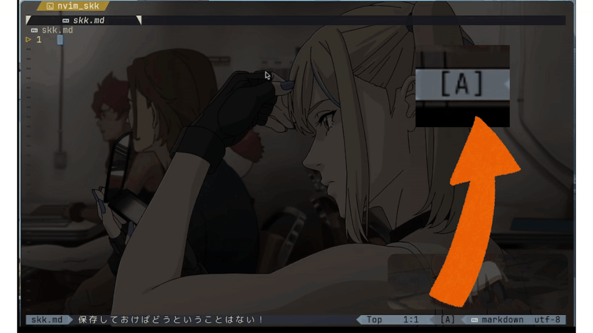
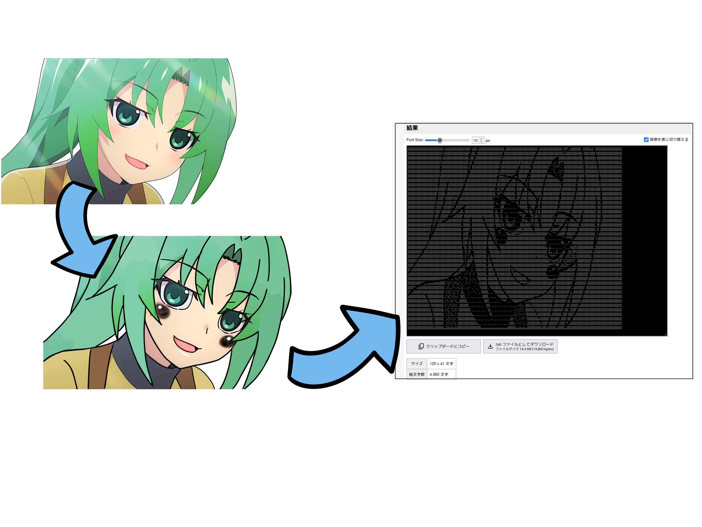
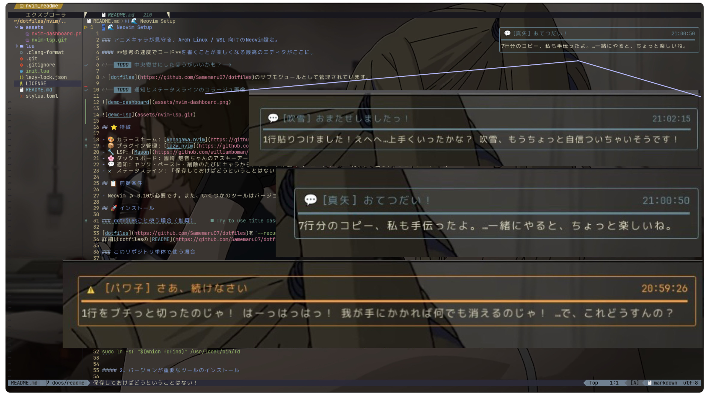
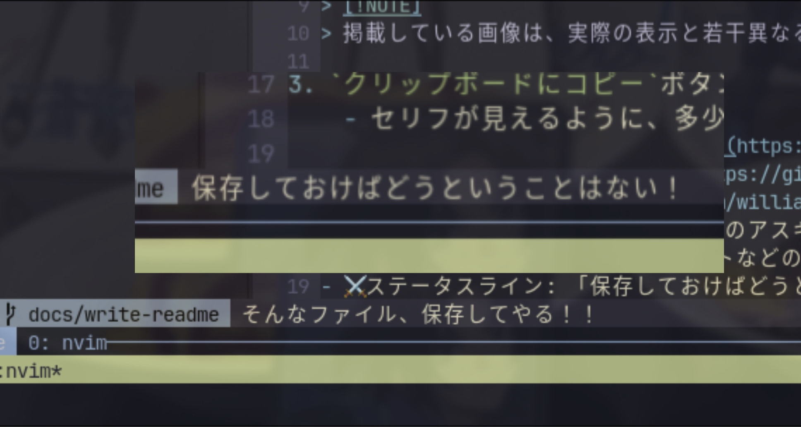
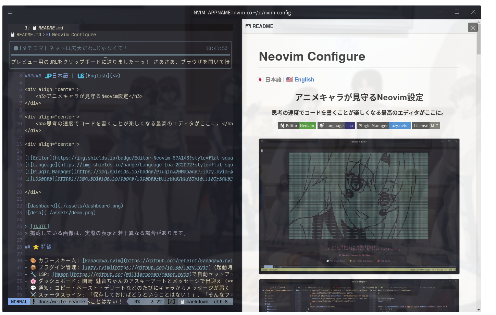

# Neovim Configure

<!--###### 🇯🇵 日本語 | 🇺🇸 [English](./README.en.md)-->

###### 🇯🇵 日本語 | 🇺🇸 [English](<>)

<div align="center">
    <h3>アニメキャラが見守るNeovim設定</h3>
</div>

<div align="center">
    <h5>思考の速度でコードを書くことが楽しくなる最高のエディタがここに。</h5>
</div>

<div align="center">

[](https://neovim.io)
[](https://www.lua.org)
[](https://github.com/folke/lazy.nvim)
[](./LICENSE)

</div>




> **💡 Note:** 掲載している画像は、実際の表示と若干異なる場合があります。
> 背景画像は、エミュレータやOS側の設定によるものです

## ⭐ 特徴

- 🎨 カラースキーム: [kanagawa.nvim](https://github.com/rebelot/kanagawa.nvim)
- 📦 プラグイン管理: [lazy.nvim](https://github.com/folke/lazy.nvim) (起動時に自動インストール)
- 🔧 LSP: [Mason](https://github.com/williamboman/mason.nvim)で自動セットアップ。
- 🌸 ダッシュボード: 園崎 魅音ちゃんのアスキーアートとメッセージで出迎え (**ひぐらしのなく頃に**)
- 💬 通知: コピー・ペースト・デリートなどのたびにキャラからメッセージが届く (**コードギアス・青ブタ・艦これ・チェンソーマン・攻殻機動隊S.A.C.**)
- ⚔️ ステータスライン: 「保存しておけばどうということはない！」、「そんなファイル、保存してやる！！」 (**機動戦士ガンダム & Zガンダム**)

## 📋 前提条件

- OS: Linux (WSLにも対応)
    - Arch Linux, Ubuntu(WSL)で動作確認済みです。
    - 本リポジトリではパッケージ管理ツールに関しては、Archの`pacman`, Ubuntuの`apt`を用いて説明しています。

## 📁 ディレクトリ構成

```
nvim/
    ├ init.lua              # エントリーポイント
    ├ lazy-lock.json        # プラグインのバージョンロックファイル
    ├ lua/
    │   ├ core/             # オプション・キーマップ・オートコマンド
    │   ├ plugins/          # プラグイン設定 (lazy.nvim)
    │   └ data/             # 通知メッセージのデータ
    ├ .clang-format         # C系言語用フォーマッタ (C, C++, Objective-*対応)
    └ assets/               # README用画像
```

## 🚀 インストール

##### 0. 事前準備

```bash
# Arch Linuxの場合
sudo pacman -S git curl
# Ubuntuの場合
sudo apt install git curl
```

##### 1. リポジトリのクローン

```bash
git clone https://github.com/Samemaru07/nvim-config ~/.config/nvim
```

##### 2. 依存パッケージ等のインストール

Neovimの起動に必要な必須パッケージです。

<details>
<summary>Archの場合</summary>

```bash
sudo pacman -S lazygit npm nodejs unzip wl-clipboard deno less zathura python-pip
pip install --user neovim-remote  # nvr
```

</details>

<details>
<summary>Ubuntuの場合</summary>

```bash
sudo apt install lazygit npm nodejs unzip deno less zathura python3-pip
pip install --user neovim-remote  # nvr
```

WSL環境では、Windowsクリップボードとの共有に`win32yank.exe`が別途必要です。

```bash
mkdir -p ~/.local/bin
curl -sLo /tmp/win32yank.zip https://github.com/equalsraf/win32yank/releases/latest/download/win32yank-x64.zip
unzip -p /tmp/win32yank.zip win32yank.exe > ~/.local/bin/win32yank.exe
chmod +x ~/.local/bin/win32yank.exe
rm /tmp/win32yank.zip
```

</details>

##### 3. Anaconda環境構築

Jupyter Notebook形式(`.ipynb`)のファイル実行をサポートしています。
必須ではありません。

Arch Linux・WSLでAnaconda環境(パッケージ含む)は共有されないため、**両OSそれぞれで個別に構築が必要**です。

```bash
conda create -n py313 python=3.13
conda activate py313
pip install pynvim jupyter_client
```

`core/options.lua`の`python3_host_prog`は以下のパスを想定しています。

```lua
vim.g.python3_host_prog = vim.fn.expand("~/anaconda3/envs/py313/bin/python")
```

##### 4. SKK辞書の導入

skkeletonによる日本語入力を利用する場合に必要です。
必須ではありません。

```bash
mkdir -p ~/.skk
curl -o ~/.skk/SKK-JISYO.L https://raw.githubusercontent.com/skk-dev/dict/master/SKK-JISYO.L
```

> **💡 Note:** ユーザー辞書（`~/.skkeleton`）はskkeletonが初回変換時に自動生成するため、手動作成は不要です。

##### 5. TeX環境の構築

LaTeXファイル(`.tex`)をコンパイルする場合に必要です。
必須ではありません。

<details>
<summary>Archの場合</summary>

```bash
sudo pacman -S texlive-basic texlive-latex texlive-latexextra texlive-luatex texlive-langjapanese
```

※ ストレージに余裕がある場合は、`sudo pacman -S texlive-meta` でフルインストールが可能です。

</details>

<details>
<summary>Ubuntuの場合</summary>

```bash
sudo apt install texlive-latex-extra texlive-luatex texlive-lang-japanese latexmk
```

※ ストレージに余裕がある場合は、`sudo apt install texlive-full` でフルインストールが可能です。

</details>

##### 6. 初回起動

```bash
nvim
```

> **💡 Tip:** 起動するとlazy.nvimが自動でプラグインをインストールします。
> Masonも自動でLSPサーバをセットアップします。

## 🔌 プラグイン一覧

<details>
<summary>UI</summary>

| プラグイン名                                                        | 説明                     |
| ------------------------------------------------------------------- | ------------------------ |
| [nvim-web-devicons](https://github.com/nvim-tree/nvim-web-devicons) | アイコン表示             |
| [neo-tree.nvim](https://github.com/nvim-neo-tree/neo-tree.nvim)     | ファイルエクスプローラ   |
| [bufferline.nvim](https://github.com/akinsho/bufferline.nvim)       | バッファライン表示       |
| [lualine.nvim](https://github.com/nvim-lualine/lualine.nvim)        | ステータスライン         |
| [toggleterm.nvim](https://github.com/akinsho/toggleterm.nvim)       | ターミナルトグル         |
| [trouble.nvim](https://github.com/folke/trouble.nvim)               | 診断・参照の一覧表示     |
| [kanagawa.nvim](https://github.com/rebelot/kanagawa.nvim)           | カラースキーム           |
| [alpha-nvim](https://github.com/goolord/alpha-nvim)                 | ダッシュボード           |
| [hlchunk.nvim](https://github.com/shellRaining/hlchunk.nvim)        | インデントハイライト     |
| [noice.nvim](https://github.com/folke/noice.nvim)                   | UI拡張                   |
| [nui.nvim](https://github.com/MunifTanjim/nui.nvim)                 | UI部品ライブラリ         |
| [nvim-notify](https://github.com/rcarriga/nvim-notify)              | 通知システム             |
| [which-key.nvim](https://github.com/folke/which-key.nvim)           | キーバインド表示         |
| [todo-comments.nvim](https://github.com/folke/todo-comments.nvim)   | TODOコメント強調         |
| [dropbar.nvim](https://github.com/Bekaboo/dropbar.nvim)             | ウィンバーナビゲーション |

</details>

<details>
<summary>LSP</summary>

| プラグイン名                                                                              | 説明                        |
| ----------------------------------------------------------------------------------------- | --------------------------- |
| [nvim-lspconfig](https://github.com/neovim/nvim-lspconfig)                                | LSP設定                     |
| [mason.nvim](https://github.com/williamboman/mason.nvim)                                  | LSP/DAP/Linterマネージャ    |
| [mason-tool-installer.nvim](https://github.com/WhoIsSethDaniel/mason-tool-installer.nvim) | Masonツール自動インストール |
| [mason-lspconfig.nvim](https://github.com/williamboman/mason-lspconfig.nvim)              | Mason-LSP連携               |
| [lazydev.nvim](https://github.com/folke/lazydev.nvim)                                     | Lua LSP拡張                 |
| [luvit-meta](https://github.com/Bilal2453/luvit-meta)                                     | Lua型定義                   |
| [fidget.nvim](https://github.com/j-hui/fidget.nvim)                                       | LSP進捗表示                 |

</details>

<details>
<summary>補完</summary>

| プラグイン名                                                                        | 説明              |
| ----------------------------------------------------------------------------------- | ----------------- |
| [blink.cmp](https://github.com/saghen/blink.cmp)                                    | 補完エンジン      |
| [blink-emoji.nvim](https://github.com/moyiz/blink-emoji.nvim)                       | 絵文字補完ソース  |
| [friendly-snippets](https://github.com/rafamadriz/friendly-snippets)                | スニペット集      |
| [skkeleton](https://github.com/vim-skk/skkeleton)                                   | SKK日本語入力     |
| [denops.vim](https://github.com/vim-denops/denops.vim)                              | Denoランタイム    |
| [skkeleton_indicator.nvim](https://github.com/delphinus/skkeleton_indicator.nvim)   | SKKモード表示     |
| [skkeleton-henkan-highlight](https://github.com/NI57721/skkeleton-henkan-highlight) | SKK変換ハイライト |
| [ddc.vim](https://github.com/Shougo/ddc.vim)                                        | 補完基盤          |
| [pum.vim](https://github.com/Shougo/pum.vim)                                        | 補完メニューUI    |
| [ddc-ui-pum](https://github.com/Shougo/ddc-ui-pum)                                  | ddc用PUM UI       |

</details>

<details>
<summary>エディタ</summary>

| プラグイン名                                                                                  | 説明             |
| --------------------------------------------------------------------------------------------- | ---------------- |
| [nvim-treesitter](https://github.com/nvim-treesitter/nvim-treesitter)                         | シンタックス解析 |
| [nvim-treesitter-textobjects](https://github.com/nvim-treesitter/nvim-treesitter-textobjects) | TextObject拡張   |
| [nvim-autopairs](https://github.com/windwp/nvim-autopairs)                                    | 括弧自動補完     |
| [Comment.nvim](https://github.com/numToStr/Comment.nvim)                                      | コメントトグル   |
| [nvim-surround](https://github.com/kylechui/nvim-surround)                                    | 囲み文字操作     |
| [flash.nvim](https://github.com/folke/flash.nvim)                                             | 高速移動         |
| [emmet-vim](https://github.com/mattn/emmet-vim)                                               | HTML/CSS展開     |

</details>

<details>
<summary>言語</summary>

| プラグイン名                                                                      | 説明               |
| --------------------------------------------------------------------------------- | ------------------ |
| [vimtex](https://github.com/lervag/vimtex)                                        | LaTeX統合環境      |
| [markdown-preview.nvim](https://github.com/iamcco/markdown-preview.nvim)          | Markdownプレビュー |
| [bibcite.nvim](https://github.com/aidavdw/bibcite.nvim)                           | BibTeX管理         |
| [NotebookNavigator.nvim](https://github.com/GCBallesteros/NotebookNavigator.nvim) | Notebook操作       |
| [image.nvim](https://github.com/3rd/image.nvim)                                   | 画像表示           |
| [molten-nvim](https://github.com/benlubas/molten-nvim)                            | Jupyter風実行環境  |
| [jupytext.nvim](https://github.com/GCBallesteros/jupytext.nvim)                   | Notebook同期       |
| [nvim-lint](https://github.com/mfussenegger/nvim-lint)                            | Linter管理         |
| [conform.nvim](https://github.com/stevearc/conform.nvim)                          | フォーマッタ管理   |

</details>

<details>
<summary>ツール</summary>

| プラグイン名                                                                             | 説明               |
| ---------------------------------------------------------------------------------------- | ------------------ |
| [telescope.nvim](https://github.com/nvim-telescope/telescope.nvim)                       | ファジーファインダ |
| [nvim-spectre](https://github.com/nvim-pack/nvim-spectre)                                | 検索置換UI         |
| [gitsigns.nvim](https://github.com/lewis6991/gitsigns.nvim)                              | Git差分表示        |
| [telescope-fzf-native.nvim](https://github.com/nvim-telescope/telescope-fzf-native.nvim) | Telescope高速化    |
| [plenary.nvim](https://github.com/nvim-lua/plenary.nvim)                                 | Lua関数ライブラリ  |
| [vim-bbye](https://github.com/moll/vim-bbye)                                             | バッファ削除補助   |

</details>

## 🛠️ ツール一覧

<details>
<summary>フォーマッタ</summary>

| ツール名               | 対象言語                                     |
| ---------------------- | -------------------------------------------- |
| prettier               | HTML、JavaScript、TypeScript、JSON、Markdown |
| black                  | Python                                       |
| clang_format           | C、C++、Processing                           |
| pint                   | PHP                                          |
| stylua                 | Lua                                          |
| shfmt                  | Shell                                        |
| pg_format              | SQL                                          |
| latexindent            | LaTeX、BibTeX                                |
| verible-verilog-format | Verilog                                      |
| goimports              | Go                                           |
| qmlformat              | QML                                          |
| markdownlint           | Markdown                                     |

</details>

<details>
<summary>Linter</summary>

| ツール名   | 対象言語 |
| ---------- | -------- |
| ruff       | Python   |
| ghdl       | VHDL     |
| shellcheck | Shell    |

</details>

<details>
<summary>LaTeX</summary>

| ツール名      | 説明                  |
| ------------- | --------------------- |
| latexmk       | LaTeX自動ビルドツール |
| lualatex      | LaTeXエンジン         |
| neovim-remote | vimtex用リモート操作  |
| zathura       | PDFビューア           |

</details>

<details>
<summary>SKK辞書</summary>

| 辞書名       | 説明                    |
| ------------ | ----------------------- |
| SKK-JISYO.L  | SKK辞書（システム辞書） |
| ~/.skkeleton | SKKユーザー辞書         |

</details>

## ⌨️ キーマップ一覧

- `<leader>`, `<localleader>`はスペースキーです。
- `<C>: Ctrl`, `<A>: Alt`, `<S>: Shift`です。
- モードの略称: `n` = ノーマル、`i` = インサート、`v` = ビジュアル、`c` = コマンド、`t` = ターミナル、`s` = セレクト、`o` = オペレータ待機 [^footnote]
    [^footnote]: `s`(セレクト) と `o`(オペレータ待機)は主にプラグインが内部で使用するモードです。通常操作で意識する必要はありません。
- 本configでは、コピー=ヤンク、つまりレジスタに送信されるものはシステムのクリップボードに送信されます。

<details>
<summary>基本編集</summary>

| キー                     | モード        | 動作                               |
| ------------------------ | ------------- | ---------------------------------- |
| `<leader>h/j/k/l`        | n             | ウィンドウ移動（左/下/上/右）      |
| `<C-g>`                  | i, v, c, s, o | Escキー                            |
| `<C-g>`                  | t             | ターミナルノーマルへ移行           |
| `<C-Right/Left>`         | t             | 単語移動（右/左）                  |
| `<C-s>`                  | n, i, v       | フォーマット & 保存                |
| `<leader>sq`             | n, v          | フォーマット & 保存 & バッファ削除 |
| `<leader>q`              | n             | バッファ削除（保存なし）           |
| `<C-c>`                  | n, v          | コピー                             |
| `<C-v>`                  | n, i, v       | 貼り付け                           |
| `<C-a>`                  | n, v          | 全選択                             |
| `<C-h>`                  | i, n          | 単語削除（後方）                   |
| `<C-l>`                  | i, n          | 単語削除（前方）                   |
| `<A-Up/Down/Left/Right>` | n, i, v, t    | ウィンドウリサイズ                 |
| `<leader><Up/Down>`      | n, v          | 行移動                             |
| `<leader>cu/cd`          | n, v          | 行複製（上/下）                    |
| `dd`                     | n             | 行削除（ブラックホールレジスタ）   |
| `xx`                     | n             | 行カット                           |
| `d` / `x`                | v             | 削除 / カット                      |
| `+/-`                    | n             | 数値インクリメント/デクリメント    |
| `<S-e>`                  | n, v          | 対応する括弧へジャンプ             |
| `<C-\>`                  | i, n, t       | ターミナルをトグル                 |

</details>

<details>
<summary>ファイル・検索・バッファ</summary>

| キー          | モード | 動作                                          |
| ------------- | ------ | --------------------------------------------- |
| `<leader>e`   | n      | ファイルツリー表示/非表示                     |
| `<leader>ff`  | n      | ファイル検索                                  |
| `<leader>fg`  | n      | 全ファイル検索（grep）                        |
| `<leader>fb`  | n      | バッファ一覧                                  |
| `<leader>fh`  | n      | ヘルプタグ検索                                |
| `<leader>fc`  | n      | 検索置換UI（Spectre）                         |
| `<leader>sr`  | n      | Spectre切り替え                               |
| `<leader>bd`  | n      | バッファ削除                                  |
| `<leader>.`   | n      | 次のバッファへ                                |
| `<leader>,`   | n      | 前のバッファへ                                |
| `<leader>1-9` | n      | バッファ1〜9へ移動                            |
| `<leader>bv`  | n, v   | 垂直分割                                      |
| `<leader>bh`  | n, v   | 水平分割                                      |
| `<leader>g`   | n      | LazyGit起動                                   |
| `<leader>;`   | n      | Winbarのシンボル選択 (パンくずナビゲーション) |

</details>

<details>
<summary>LSP / 診断</summary>

| キー         | モード | 動作             |
| ------------ | ------ | ---------------- |
| `K`          | n      | ホバー表示       |
| `gd`         | n      | 定義へジャンプ   |
| `gr`         | n      | 参照一覧表示     |
| `<leader>rn` | n      | リネーム         |
| `<leader>ca` | n      | コードアクション |
| `[d`         | n      | 前の診断へ移動   |
| `]d`         | n      | 次の診断へ移動   |
| `<leader>xt` | n      | TODO一覧         |
| `<leader>xx` | n      | 診断一覧         |
| `<leader>xq` | n      | quickfix一覧     |

</details>

<details>
<summary>コメント</summary>

| キー  | モード | 動作                 |
| ----- | ------ | -------------------- |
| `gcc` | n      | 行コメントのトグル   |
| `gc`  | n, v   | 範囲コメントのトグル |

</details>

<details>
<summary>日本語入力 / テキストオブジェクト</summary>

| キー    | モード  | 動作             |
| ------- | ------- | ---------------- |
| `<C-j>` | i, c    | SKKトグル        |
| `<C-g>` | SKK     | SKK終了          |
| `q`     | SKK     | カタカナ変換     |
| `Q`     | SKK     | 半角カタカナ変換 |
| `af/if` | x, o    | 関数を選択       |
| `ac/ic` | x, o    | クラスを選択     |
| `aa/ia` | x, o    | 引数を選択       |
| `]f/[f` | n, x, o | 関数移動         |

</details>

<details>
<summary>LaTeX (vimtex)</summary>

| キー              | モード | 動作                                   |
| ----------------- | ------ | -------------------------------------- |
| `<localleader>ll` | n      | コンパイル開始/停止（continuous mode） |
| `<localleader>lv` | n      | PDFビューワーを開く（順方向検索）      |
| `<localleader>le` | n      | コンパイルエラー一覧を表示             |
| `<localleader>lc` | n      | 中間ファイルを削除                     |
| `<localleader>lt` | n      | 目次を表示                             |
| `<localleader>lk` | n      | コンパイルを停止                       |

> **💡 Note:** コンパイルが開始されていないとき、またはコンパイルエラー時は、`<C-s>`でコンパイルを(リ)スタートします。

> **💡 Note:** zathuraでPDFを開いた状態で`Ctrl+Click`すると、クリックした箇所に対応する行へ逆サーチします。

</details>

<details>
<summary>Notebook / Molten / 文献</summary>

| キー              | モード | 動作                         |
| ----------------- | ------ | ---------------------------- |
| `]h / [h`         | n      | Notebookセル移動             |
| `<localleader>mc` | n      | 現在のセルを実行             |
| `<localleader>mC` | n      | 現在のセルを実行して次へ移動 |
| `<localleader>mi` | n      | Molten初期化                 |
| `<localleader>me` | n      | オペレータを実行             |
| `<localleader>ml` | n      | 現在行を実行                 |
| `<localleader>mr` | n      | セルを再実行                 |
| `<localleader>mv` | v      | ビジュアル選択を実行         |
| `<localleader>md` | n      | 出力削除                     |
| `<localleader>mh` | n      | 出力非表示                   |
| `<localleader>mo` | n      | 出力ウィンドウへ移動         |
| `<localleader>mn` | n      | 次の出力へ                   |
| `<localleader>mp` | n      | 前の出力へ                   |
| `<localleader>mx` | n      | 実行中セルを中断             |
| `<localleader>mR` | n      | Molten再起動                 |
| `<leader>ci`      | n      | 引用挿入                     |
| `<leader>cp`      | n      | 引用情報表示                 |
| `<leader>co`      | n      | 引用ファイルを開く           |
| `<leader>cn`      | n      | ノートを開く                 |

</details>

<details>
<summary>補完 / その他</summary>

| キー         | モード | 動作                                    |
| ------------ | ------ | --------------------------------------- |
| `<Tab>`      | i      | PUM(補完ウィンドウ)表示時に次候補へ移動 |
| `<S-Tab>`    | i      | PUM(補完ウィンドウ)表示時に前候補へ移動 |
| `<leader>m`  | n      | 直前に入力したEmmetのプレフィクス       |
| `<leader>w`  | n      | 単語を直後に入力する括弧系で囲む        |
| `<leader>W`  | n      | 行を直後に入力する括弧系で囲む          |
| `<leader>dq` | n      | 引用符削除                              |
| `<leader>cq` | n      | 引用符を直後に入力する文字に変更        |
| `<leader>rr` | n      | Neovim設定リロード                      |

</details>

## ✨ こだわりポイント

### SKKモード表示

SKKの入力モードをステータスラインに表示する。



| モード           | 表示 |
| ---------------- | ---- |
| 英語入力         | [A]  |
| ひらがな入力     | [あ] |
| カタカナ入力     | [ア] |
| 半角カタカナ入力 | [ｱ]  |

### ダッシュボード

Neovimを起動するたびに、「ひぐらしのなく頃に」より、**園崎 魅音**ちゃんのアスキーアートとセリフが出迎えてくれる。

<div align="center"><h5>私の初恋の娘です</h5></div>


> 『よーし、頑張ってこー！無理しすぎんなよ？......ふふ、なんかそうやって頑張ってるの、見てるといいなって思うんだ。』

<div align="center"><h4>ぜひお嫁さんになっていただきたい。</h4></div>

<details>
<summary>点字アスキーアートの作り方</summary>

[こちら](https://lazesoftware.com/ja/tool/brailleaagen/)のサイトで作成しました。

1. 点字AAにしたい画像を用意
    - ほっぺの赤らみが認識されずらいようなので、濃い灰色で塗っておき、つやを白で塗っておきましょう。
    - 細かい影はAAでは変に目立つので、髪の色などは一定にしておきます。
    - また、背景もそのままAAになると魅音ちゃんが目立たないので、背景は白で塗り潰しておきます。
2. 上記のリンクにアクセスし、`画像から`を選択し、`拡大縮小`の割合を30%ほどに、`詳細設定`を開き`ネガポジ反転する`にチェックを入れ、`実行`ボタンを押す。
    - フォントサイズを実際のフォントサイズに調整し、黒背景にすると見やすいです。(この`結果`のテキストブロックの大きさも調整できます。)
3. `クリップボードにコピー`ボタンを押し、`lua/plugins/alpha.lua`の`header_art`に代入。
    - セリフが見えるように、多少上下をカットするのがベスト。



> 魅音ちゃんの画像は[コチラ](https://x.com/5sVzDwTrW9kzYjs/status/1810690455992205717)

</details>

### 通知メッセージ

> **💡 Note:** カスタム通知はコピー・ペースト・カット・デリートのみに対応しています。

操作に応じて、アニメキャラクターたちからランダムに通知が届く。
登場作品は、「コードギアス」、「蒼穹のファフナー」、「青ブタ」、「艦これ」、「チェンソーマン」、「攻殻機動隊 S.A.C.」。

#### お気に入りのメッセージたち



> **💡 Note:** `%s`は、`n行`に置き換えてください。<操作した行数+"行">のプレースホルダーです。

| 操作     | キャラクター            | メッセージ                                                                                                                |
| -------- | ----------------------- | ------------------------------------------------------------------------------------------------------------------------- |
| コピー   | 真矢 (蒼穹のファフナー) | おてつだい！<br>%s分のコピー、私も手伝ったよ。...一緒にやると、ちょっと楽しいね。                                         |
| ペースト | 吹雪 (艦これ)           | おまたせしましたっ！<br>%s貼りつけました！えへへ、...上手くいったかな？吹雪、もうちょっと自信ついちゃいそうです！         |
| カット   | パワ子 (チェンソーマン) | さあ、続けなさい<br>%sをブチっと切ったのじゃ！はーっはっはっ！我が手にかかれば何でも消えるのじゃ！...で、これどうすんの？ |
| デリート | タチコマ (攻機SAC)      | 切り取りましたー！<br>%sを切り取りました！ いったんこっちに持ってきておきますね。……あれ？ これ、どこに運ぶんでしたっけ？  |

<div align="center"><h4>尊い。尊すぎるよ。</h4></div>

<details>
<summary>メッセージの変更方法</summary>

- メッセージを編集したい場合は`lua/data/messages.lua`を変更してください。

```lua
    {
        title = "[人名] タイトル",
        message = "メッセージ",
        -- %sで<n行>が埋め込まれます。
    },
```

</details>

### ステータスライン

ファイルの保存状態に応じて、ガンダムの名言をオマージュしたメッセージが表示される。



| 状態     | キャラクター                          | メッセージ                           |
| -------- | ------------------------------------- | ------------------------------------ |
| 保存済み | シャア・アズナブル (機動戦士ガンダム) | 保存しておけばどうということはない！ |
| 未保存   | カミーユ・ビダン (機動戦士Zガンダム)  | そんなファイル、保存してやる！！     |

> 元ネタ:\
> 「当たらなければどうということはない！」(シャア・アズナブル / 機動戦士ガンダム 第2話「ガンダム破壊命令」)\
> 「そんな大人、修正してやる！」(カミーユ・ビダン / 機動戦士Zガンダム 第13話「シャトル発進」)

<div align="center"><h4>私が思いついたのはこの程度ですが、非常に満足しています</h4></div>

<details>
<summary>ステータスメッセージの変更方法</summary>

- ステータスメッセージを編集したい場合は、`lua/plugins/lualine.lua`の`lualine_c`テーブルの部分を変更してください。

```lua
        lualine_c = {
            {
                function()
                    if vim.bo.buftype == "terminal" then
                        return ""
                    end
                    local ft = vim.bo.filetype
                    if ft == "neo-tree" then
                        return ""
                    end
                    if ft == "alpha" then
                        return ""
                    end

                    if vim.bo.modified then
                        return "<未保存のときのメッセージ>"
                    else
                        return "<保存済みのときのメッセージ>"
                    end
                end,
                color = nil,
            },
        },

```

</details>

### Hyperとの連携

mdファイルを編集していて、`:MarkdownPreview`コマンドを実行すると、`markdown-preview.nvim`により、ローカルサーバのURLがクリップボードへ送信されます。

> タチコマから報告 (通知) が来ます。えっへん！

私が実装した[Webview機能内蔵Hyper](https://github.com/Samemaru07/hyper-webview-fork/tree/main)を用いれば、ペインを分割して、そのURLを`echo`しクリックすると、わざわざブラウザを隣に並べなくても、簡単にリアルタイム同期を実装することができます！



> Webのコーディング支援AIをよく使う方にとっては、ページの切り替えなどの手間が減るかもしれません！

## 📄 ライセンス

このプロジェクトは[MITライセンス](./LICENSE)のもとで公開されています。
